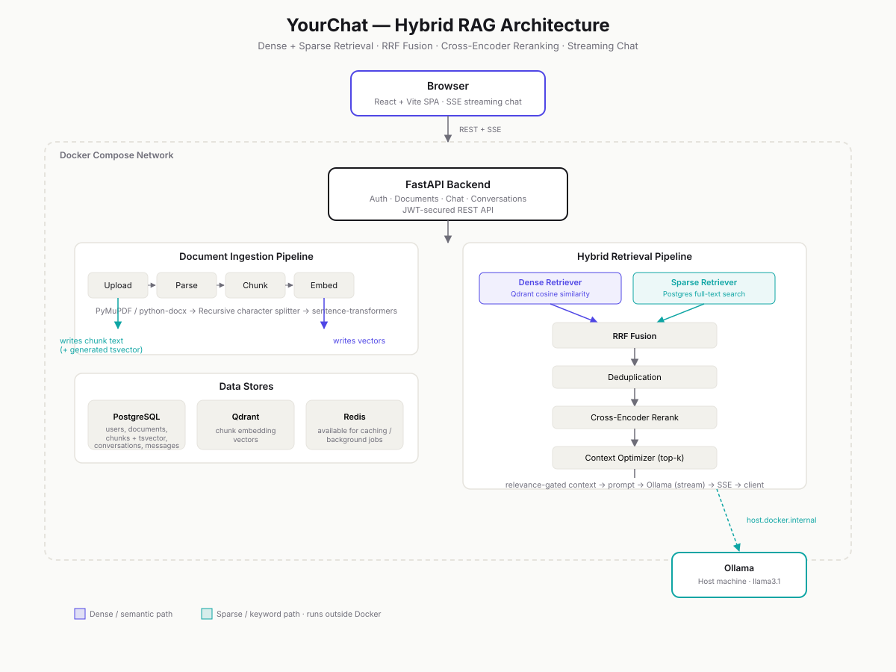

# YourChat — Hybrid RAG Knowledge Platform

A production-shaped Retrieval-Augmented Generation platform: upload your own documents, then chat with an AI assistant that grounds its answers in them — combining **dense (semantic) and sparse (keyword) retrieval**, fused with **Reciprocal Rank Fusion** and refined with **cross-encoder reranking**, served through a **ChatGPT/Claude-style streaming chat interface**.

Built end-to-end: FastAPI backend, React frontend, fully containerized with Docker Compose, with a real retrieval evaluation harness backing its quality claims — not just "it seemed to work."



---

## Highlights

- **True hybrid retrieval** — dense embedding search (Qdrant) *and* keyword search (PostgreSQL full-text search with generated `tsvector` columns), fused via Reciprocal Rank Fusion rather than picking one strategy
- **Cross-encoder reranking** — a second-pass relevance model reorders the fused candidates before they reach the LLM, correcting cases where retrieval's own scoring gets the ranking wrong
- **Relevance-gated generation** — if nothing relevant is retrieved, the assistant answers from general knowledge instead of hard-refusing, the same way ChatGPT/Claude behave
- **Real-time streaming chat** — Server-Sent Events, with live citations and conversation-sidebar updates as retrieval completes, not just at the end
- **Full conversation persistence** — rename, delete, resume threads; edit a past message (truncates and regenerates everything after it, matching how ChatGPT/Claude edit actually works); regenerate any reply in place without duplicating history
- **Attach documents directly from the chat composer**, not just a separate upload page
- **Fully Dockerized** — `docker compose up` runs the entire stack: frontend, backend, Postgres, Qdrant, Redis
- **Backed by a real evaluation harness** — Recall@k and MRR measured across dense-only, hybrid, and hybrid+reranked configurations (see [Evaluation](#evaluation) below)

---

## Tech Stack

| Layer | Technology |
|---|---|
| Frontend | React 19, TypeScript, Vite, Tailwind CSS v4, React Router |
| Backend | FastAPI, SQLAlchemy 2.0, Alembic, Pydantic v2 |
| Dense retrieval | Qdrant (vector database), `sentence-transformers` |
| Sparse retrieval | PostgreSQL full-text search (`tsvector` + GIN index) |
| Reranking | Cross-encoder (`sentence-transformers`) |
| LLM | Ollama (local inference) |
| Auth | JWT (`python-jose`), `passlib`/`bcrypt` |
| Infra | Docker, Docker Compose, nginx (frontend serving) |

---

## Why Hybrid Retrieval

Dense embedding search is excellent at matching *meaning* — a question phrased completely differently from the source text can still find it. But it's weak at exact terms: account numbers, IDs, dates, acronyms, and rare proper nouns often get blurred past by semantic similarity. Sparse/keyword search is the opposite — it nails exact terms but misses paraphrases.

This project runs **both** retrievers against every query and fuses their independently-ranked results using **Reciprocal Rank Fusion**, which combines rankings by position rather than raw score — avoiding the problem of comparing incompatible scales (cosine similarity vs. keyword rank). A **cross-encoder** then re-scores the fused candidates by feeding the query and each candidate through one model together, which is slower but far more accurate than the bi-encoder similarity used in the first retrieval pass — which is exactly why it only runs on the small, already-filtered candidate pool, not the entire corpus.

---

## Evaluation

Retrieval quality is measured with `backend/evaluate_retrieval.py` against a held-out question set, comparing three configurations:

| Configuration | Recall@5 | MRR |
|---|---|---|
| Dense only | 83.3% | 0.812 |
| Hybrid (dense + sparse) | 83.3% | 0.833 |
| Hybrid + Reranked | 83.3% | 0.833 |

**Note on interpreting these numbers:** this evaluation set was generated by having an LLM read each document chunk and draft a question it answers — which naturally reuses the source text's own vocabulary, a scenario dense embedding search already handles well. The gap between dense-only and hybrid retrieval is expected to widen on queries containing exact terms, IDs, or rare proper nouns worded differently from the source text — the specific case hybrid retrieval and keyword search are designed for. The harness (`evaluate_retrieval.py --verbose`) supports per-question inspection for exactly this kind of analysis, and `generate_eval_set.py` can auto-draft a starting question set from your own uploaded documents.

---

## Getting Started

### Option A — Docker (recommended)

**Prerequisites:** Docker Desktop, [Ollama](https://ollama.com) running on your host machine with a model pulled (e.g. `ollama pull llama3.1:8b`).

```bash
git clone <your-repo-url>
cd Enterprise-Hybrid-RAG-Platform

# Create backend/.env from the template and fill in a real SECRET_KEY
cp backend/.env.example backend/.env

docker compose up --build
```

- Frontend: [http://localhost:3000](http://localhost:3000)
- Backend API docs: [http://localhost:8000/docs](http://localhost:8000/docs)

> **Windows + Ollama note:** Ollama defaults to binding only `127.0.0.1`, which Docker containers can't reach. Set the system environment variable `OLLAMA_HOST=0.0.0.0` and restart Ollama before running the stack.

### Option B — Native (for development)

**Backend:**
```bash
cd backend
python -m venv venv
venv\Scripts\activate        # Windows
# source venv/bin/activate   # macOS/Linux
pip install -r requirements.txt
alembic upgrade head
uvicorn app.main:app --reload
```

**Frontend:**
```bash
cd frontend
npm install
npm run dev
```

You'll still need Postgres, Qdrant, and Redis running — the quickest way is `docker compose up postgres redis qdrant` (just those three services) while running the backend/frontend natively.

---

## Project Structure

```
Enterprise-Hybrid-RAG-Platform/
├── backend/
│   ├── app/
│   │   ├── api/v1/          # Documents, conversations, auth, users routers
│   │   ├── chat/            # Chat orchestration, streaming, conversation service
│   │   ├── retrieval/       # Dense retriever, retrieval orchestration
│   │   ├── reranking/       # Cross-encoder reranking
│   │   ├── context/         # Deduplication, RRF merging, optimization, metrics
│   │   ├── embeddings/      # Embedding provider abstraction
│   │   ├── vectorstores/    # Qdrant integration
│   │   ├── llm/             # LLM provider abstraction (Ollama)
│   │   ├── models/          # SQLAlchemy models
│   │   ├── repositories/    # Data access layer
│   │   └── services/        # Business logic layer
│   ├── alembic/              # Database migrations
│   ├── evaluate_retrieval.py # Retrieval quality evaluation harness
│   ├── generate_eval_set.py  # Auto-generates eval questions from your documents
│   └── Dockerfile
├── frontend/
│   ├── src/
│   │   ├── api/              # Backend API clients
│   │   ├── components/       # Chat UI, layout, document management
│   │   ├── pages/            # Route-level pages
│   │   └── auth/              # Auth context/provider
│   └── Dockerfile
├── docs/
│   └── architecture.svg
└── docker-compose.yml
```

---

## API Overview

| Endpoint | Description |
|---|---|
| `POST /api/v1/auth/register`, `/login` | Authentication |
| `GET/POST/DELETE /api/v1/documents` | Document upload, listing, deletion (with vector cleanup) |
| `POST /api/v1/chat` / `/chat/stream` | Chat (blocking or SSE streaming) |
| `POST /api/v1/chat/regenerate` | Regenerate a specific reply in place |
| `GET/PATCH/DELETE /api/v1/conversations` | Conversation history management |
| `DELETE /api/v1/conversations/{id}/messages/from/{message_id}` | Truncate from a message onward (backs message editing) |

Full interactive API documentation is available at `/docs` once the backend is running.

---

## Possible Future Work

- Retrieval evaluation set expanded with hand-crafted adversarial queries (exact-term, cross-document disambiguation)
- Streaming token-level citation highlighting
- Multi-tenant document namespacing
- Automated re-embedding on chunking strategy changes

---

## License

Personal portfolio project. No license file included — add one (e.g. MIT) if you intend to accept external contributions or reuse.
